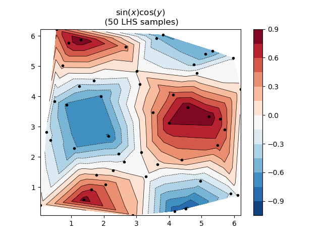

# exppy
This small package is intended for performing numerical experiments with continuous parameters. Currently parameters of the model can be randomized with uniform or log-uniform distributions in the given range. Simple random, latin hypercube or generalized subset designs can be used (supported by `pyDOE2` package).

Example:

```python
from exppy import LHSDesign, Experiment
from math import sin, cos
import pylab


class MyDesign(LHSDesign):
    spec = (('x', (0, 6.28, 'uniform', 10)),
            ('y', (0, 6.28, 'uniform', 10)))
    samples = 50


class MyModel:
    # model can be any class, but it is required to have 'solve' method
    # which takes sample `d` as argument and returns dict of results `res`
    def solve(self, d):
        x, y = d.x, d.y
        res = {'F': sin(x)*cos(y), 'G': x*y}
        return res

# Evaluate experiments and dump everything to 'test' directory:
ex = Experiment(MyDesign(), MyModel(), dirname='test')
ex.run()  

# Plot 'F'
x = ex.design.x
y = ex.design.y
F = ex.result.F
pylab.tricontour(x, y, F, levels=14, linewidths=0.5, colors='k')
cntr = pylab.tricontourf(x, y, F, levels=14, cmap="RdBu_r")
pylab.colorbar(cntr)
pylab.plot(x, y, 'ko', ms=3)
pylab.title('$\sin(x)\cos(y)$\n (%d LHS samples)' % ex.design.samples)
```

The resulting figure looks like this:


